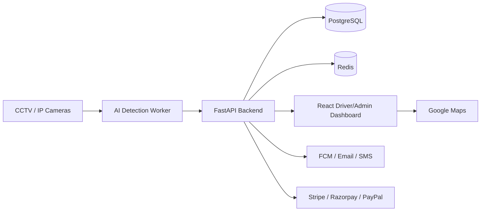

# System Architecture

## High-Level Flow

## Services

- Computer vision worker: reads streams, detects vehicles, classifies slot polygons, and publishes occupancy changes.
- API service: handles auth, reservations, payments, analytics, reports, and notification triggers.
- Web app: serves driver and administrator workflows.
- PostgreSQL: stores transactional and analytics-ready data.
- Redis: caches availability, throttles APIs, and queues real-time events.

## Production Targets

- Detection accuracy: target 95%+ after site-specific model calibration.
- API response time: target under 200 ms for cached availability reads.
- Inference speed: target 20-30 FPS using GPU acceleration and batched streams.
