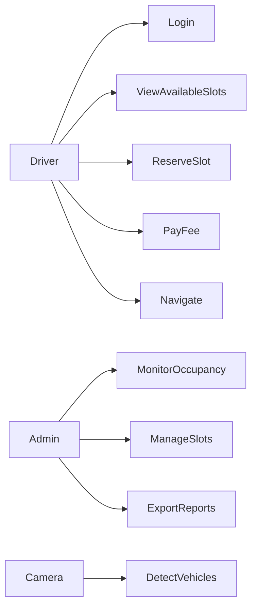
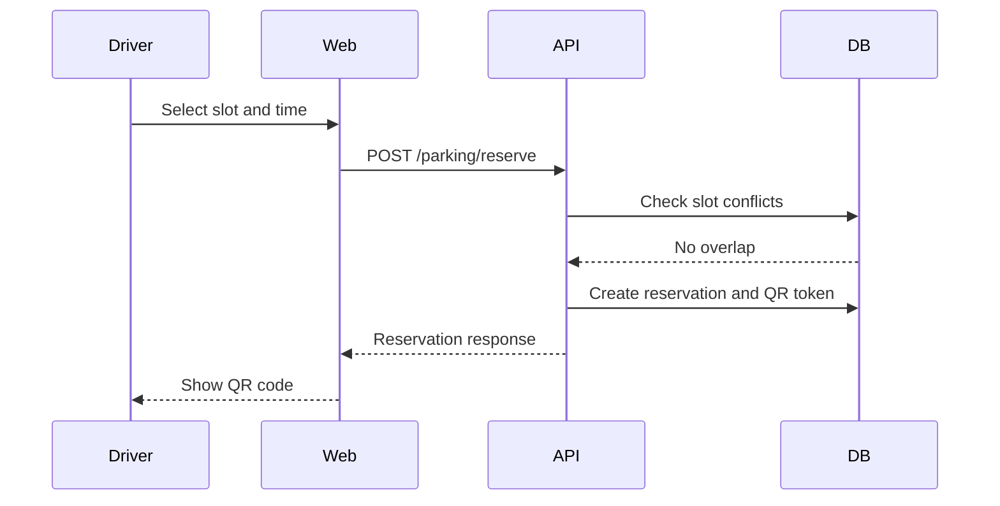
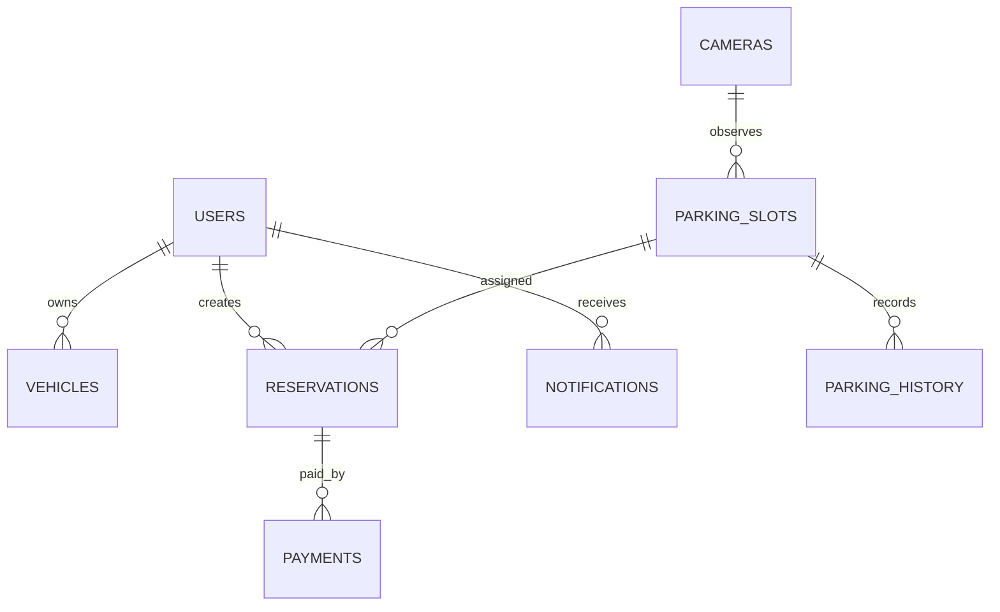
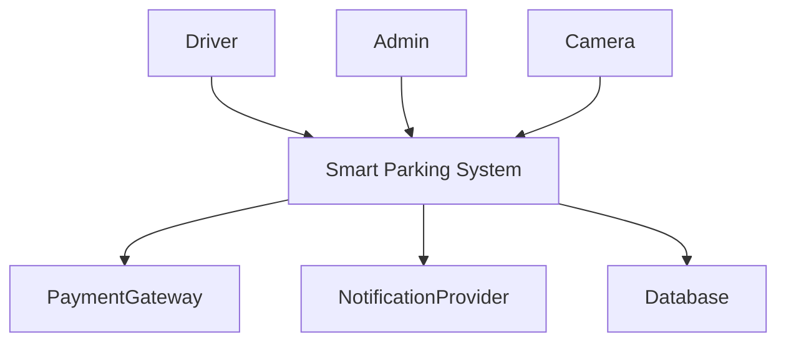

# UML and Data Diagrams

## Use Case

```mermaid
flowchart LR
    Driver --> Login
    Driver --> ViewAvailableSlots
    Driver --> ReserveSlot
    Driver --> PayFee
    Driver --> Navigate
    Admin --> MonitorOccupancy
    Admin --> ManageSlots
    Admin --> ExportReports
    Camera --> DetectVehicles
```

## Sequence: Reservation

```mermaid
sequenceDiagram
    participant Driver
    participant Web
    participant API
    participant DB
    Driver->>Web: Select slot and time
    Web->>API: POST /parking/reserve
    API->>DB: Check slot conflicts
    DB-->>API: No overlap
    API->>DB: Create reservation and QR token
    API-->>Web: Reservation response
    Web-->>Driver: Show QR code
```

## ER Diagram

```mermaid
erDiagram
    USERS ||--o{ VEHICLES : owns
    USERS ||--o{ RESERVATIONS : creates
    PARKING_SLOTS ||--o{ RESERVATIONS : assigned
    RESERVATIONS ||--o{ PAYMENTS : paid_by
    CAMERAS ||--o{ PARKING_SLOTS : observes
    USERS ||--o{ NOTIFICATIONS : receives
    PARKING_SLOTS ||--o{ PARKING_HISTORY : records
```

## DFD Level 0

```mermaid
flowchart TD
    Driver --> System[Smart Parking System]
    Admin --> System
    Camera --> System
    System --> PaymentGateway
    System --> NotificationProvider
    System --> Database
```
